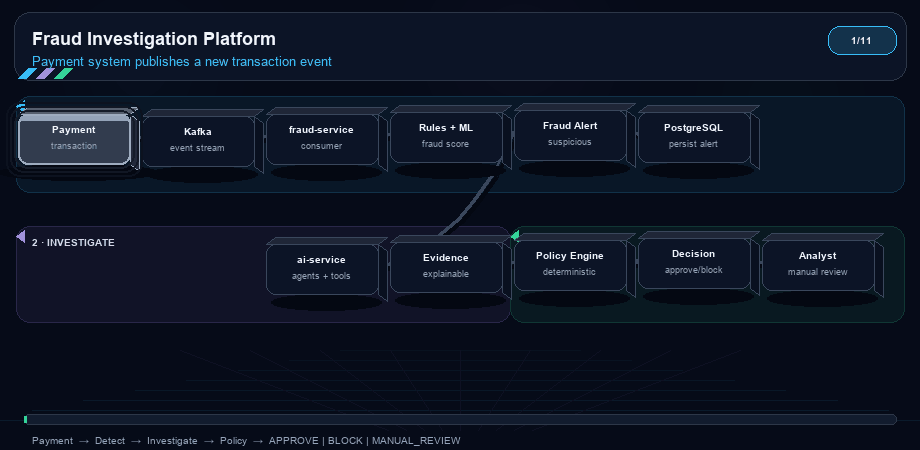
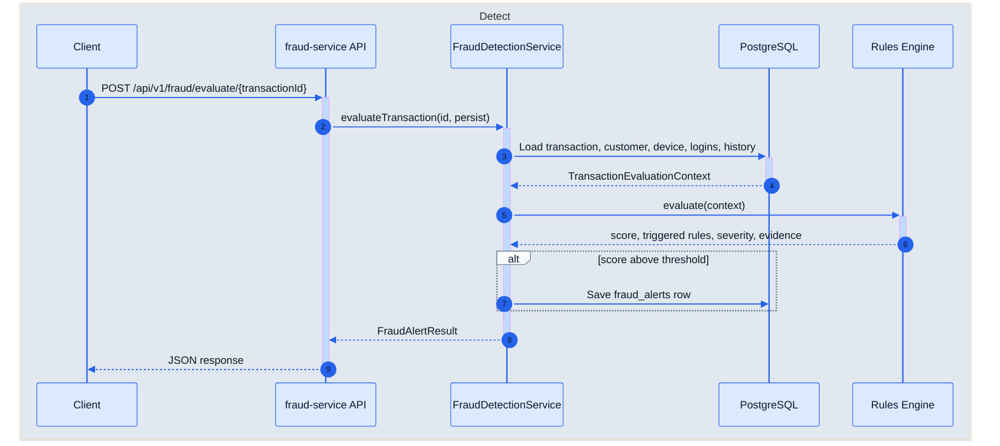
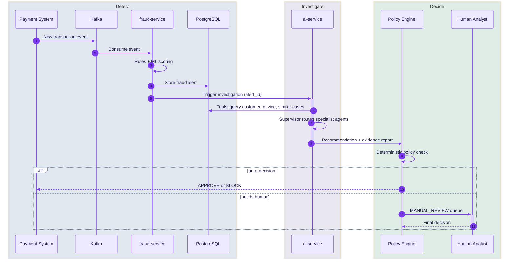

# Agentic AI Fraud Investigation Platform

An open-source, production-inspired platform that combines deterministic fraud detection, ML risk scoring, and multi-agent AI investigation for suspicious financial transactions.

The LLM investigates and explains evidence — it does **not** make final financial decisions. Policy rules and human analysts retain control.

## Business Use Case

Financial institutions, fintechs, and payment platforms lose billions each year to fraud while also blocking legitimate customers with blunt rules. Fraud operations teams need to **detect suspicious payments quickly**, **investigate with evidence**, and **decide safely**—often under regulatory scrutiny.

This platform models that real-world workflow:

```
Payment attempt → Risk screening → Alert → Investigation → Policy decision → (optional) Analyst review
```

### Who it is for

| Stakeholder | Business need |
|-------------|----------------|
| **Fraud operations** | Triage alerts faster with explainable signals, not black-box scores alone |
| **Risk & compliance** | Audit trails showing which rules fired, what evidence was reviewed, and who approved actions |
| **Engineering / data teams** | Event-driven architecture that separates detection, ML scoring, and AI investigation |
| **Developers & researchers** | Open, runnable reference for agentic AI in regulated financial workflows |

### Problems it addresses

| Challenge | How the platform helps |
|-----------|------------------------|
| **Payment fraud at scale** | Stream transactions, score risk, and flag only suspicious activity for deeper review |
| **Account takeover (ATO)** | Correlate failed logins, new devices, and abnormal spend in one investigation context |
| **Card-not-present & geo fraud** | Detect velocity spikes, new locations, and impossible travel patterns |
| **Analyst overload** | Auto-clear low-risk cases; route edge cases to humans with pre-built evidence packs |
| **Opaque AI decisions** | Keep detection deterministic; use LLM agents only to **explain** facts gathered from tools |
| **Regulatory expectations** | Preserve structured alerts, evidence JSON, and (planned) analyst decision logs |

### Example business flows

**1. Real-time payment screening (target state)**  
A customer initiates a €4,800 transfer from a new phone in a foreign country. Kafka delivers the event to `fraud-service`. Rules and ML score the transaction. A high-severity alert is raised. AI agents pull customer history, device trust, and similar past cases. The policy engine blocks the payment automatically—or queues it for manual review if confidence is borderline.

**2. Account takeover investigation**  
After several failed logins, a fraudster completes a password reset and spends on a high-risk merchant category. The rules engine triggers `MULTIPLE_FAILED_LOGINS`, `NEW_DEVICE`, and `UNUSUAL_MERCHANT_CATEGORY`. An analyst (or future AI agent) receives evidence: login IPs, device fingerprint, amount vs average spend, and merchant risk score—then decides whether to freeze the account.

**3. Fraud ring pattern detection (demo today)**  
Synthetic `fraud-ring` scenarios seed coordinated activity across linked accounts. Teams can test whether velocity, merchant, and geo rules fire together—and tune thresholds before production rollout.

### Business outcomes

Every investigated case is intended to resolve to one of three actions:

| Outcome | Business meaning |
|---------|------------------|
| **APPROVE** | Allow the payment; low fraud risk with sufficient evidence |
| **BLOCK** | Stop the payment; protect customer funds and limit liability |
| **MANUAL_REVIEW** | Escalate to a fraud analyst when automation should not decide alone |

The platform is designed so **automation accelerates investigation**, but **humans and policy rules retain authority** over money movement—matching how regulated fraud teams operate in production.

### What you can demonstrate today

With Phases 1–3, teams can already:

- Load synthetic customers and fraud scenarios into PostgreSQL  
- Evaluate a transaction through the rules API and inspect structured alerts  
- Show auditors exactly **which rules fired** and **why** (evidence JSON)  
- Build toward ML scoring, agent investigation, and analyst UI in later phases  

## Functional Overview

This project simulates a **production-style fraud operations stack** using synthetic financial data. You can stand up the database, load realistic customers and transactions, run deterministic fraud checks, and inspect structured alerts—all locally with Docker.

### Implemented today

| Area | What it does |
|------|----------------|
| **Infrastructure** | PostgreSQL (pgvector), Redis, Docker Compose, setup and health-check scripts |
| **Synthetic data** | Generates customers, merchants, devices, transactions, login events, and fraud scenarios |
| **Fraud detection** | Spring Boot rules engine scores transactions and produces auditable alerts |
| **Persistence** | Alerts saved to `fraud_alerts` with score, severity, triggered rules, and JSON evidence |
| **Testing** | Unit tests (Java/Python), integration tests against PostgreSQL |
| **AI service** | FastAPI health endpoint only (agent investigation planned) |

### Core data entities

The platform models the signals fraud teams actually use:

| Entity | Purpose |
|--------|---------|
| **Customers** | Profile, home location, average spend baseline |
| **Transactions** | Amount, merchant, device, geo coordinates, fraud labels (synthetic ground truth) |
| **Devices** | Fingerprints and trust status linked to customers |
| **Login events** | Successful and failed authentication attempts |
| **Merchants** | MCC category codes and risk scores |
| **Fraud alerts** | Rule outcomes with structured evidence (written by `fraud-service`) |
| **Fraud cases** | Historical resolved cases (schema ready for RAG in later phases) |

### Fraud scenarios (synthetic)

The data generator can inject labeled fraud patterns for demos and testing:

| Scenario | Pattern injected |
|----------|------------------|
| `normal` | Baseline non-fraud activity |
| `high-value-fraud` | Unusually large transaction vs customer history |
| `account-takeover` | Failed logins + new device + foreign high-value spend |
| `velocity-attack` | Many transactions in a short time window |
| `geographic-anomaly` | Impossible travel / distant location vs home |
| `new-device-fraud` | First-seen device on suspicious activity |
| `failed-login-attack` | Burst of failed authentication attempts |
| `fraud-ring` | Coordinated activity across linked accounts |

Each scenario produces transactions (and related login/device data) that the rules engine can evaluate.

### Fraud rules engine

Seven **deterministic rules** run against PostgreSQL context—no LLM involved in detection:

| Rule | Detects |
|------|---------|
| `HIGH_TRANSACTION_AMOUNT` | Amount above absolute threshold or customer average × multiplier |
| `NEW_DEVICE` | Unknown or recently first-seen device |
| `NEW_LOCATION` | Country not seen in customer transaction history |
| `TRANSACTION_VELOCITY` | Too many transactions within a sliding time window |
| `MULTIPLE_FAILED_LOGINS` | Failed login count above threshold |
| `UNUSUAL_MERCHANT_CATEGORY` | New or high-risk merchant category (MCC) |
| `GEOGRAPHIC_ANOMALY` | Large distance from home or impossible travel speed |

**Scoring:** each triggered rule adds configurable weight. The engine computes a normalized `fraud_score` (0–1), maps it to severity (`LOW` → `CRITICAL`), and opens an alert when the score crosses the alert threshold (default `0.25`).

**Evidence:** every triggered rule returns structured JSON (amounts, distances, counts, etc.) for analyst and audit review.

Thresholds and weights are configured in `fraud-service/src/main/resources/application.yml`.

### API (fraud-service)

| Method | Endpoint | Description |
|--------|----------|-------------|
| `GET` | `/api/v1/health` | Service health check |
| `POST` | `/api/v1/fraud/evaluate/{transactionId}?persist=true` | Evaluate one transaction; optionally persist alert |
| `GET` | `/api/v1/fraud/alerts/{alertId}` | Retrieve a previously saved alert |

Evaluation loads the transaction plus customer, merchant, device, login history, and recent activity from PostgreSQL before running rules.

### Planned capabilities

| Capability | Phase | Description |
|------------|-------|-------------|
| ML risk scoring | 4 | Behavioral fraud probability alongside rules |
| Local LLM (Ollama) | 5 | On-prem model integration |
| Multi-agent investigation | 6–10 | Supervisor + specialist agents with tool calling |
| Kafka event streaming | 11 | Real-time transaction ingestion |
| Analyst UI | 13 | Human review queue and decisions |
| RAG over past cases | 9 | Similar-case retrieval via pgvector |

See the [Roadmap](#roadmap) for the full build plan.

## Architecture

The platform is built in layers. Each layer has a single job: **detect** suspicious activity, **score** risk, **investigate** with AI, then **decide** under policy—with humans in the loop when needed.

<p align="center">
  
</p>

| Layer | Who runs it | What it does | Status |
|-------|-------------|--------------|--------|
| Detect | `fraud-service` (Spring Boot) | Rules + ML produce a fraud score and alert | Rules ✅ · ML 🔜 |
| Investigate | `ai-service` (FastAPI + LangGraph) | Agents gather facts from DB/tools and explain evidence | 🔜 |
| Decide | Policy engine + analyst UI | Deterministic APPROVE / REVIEW / BLOCK | 🔜 |

**Important:** the LLM investigates and explains—it does **not** approve or block payments. Policy rules and human analysts keep final control.

### How a request flows today (Phase 3)

You can evaluate a transaction with a single HTTP call. No Kafka or LLM is required yet.



**Step by step:**

1. **Request** — Client sends `POST /api/v1/fraud/evaluate/TXN-SUSP001?persist=true`.
2. **Load context** — Service reads the transaction and related data from PostgreSQL (customer profile, device, recent logins, transaction history).
3. **Run rules** — Seven deterministic rules check patterns (high amount, new device, velocity, etc.). Each triggered rule adds weight and structured evidence.
4. **Score & severity** — Weighted rules produce a `fraud_score` (0–1) and a severity (`LOW` → `CRITICAL`).
5. **Persist (optional)** — If the score crosses the alert threshold, a row is written to `fraud_alerts`.
6. **Respond** — JSON includes `alert_id`, `fraud_score`, `triggered_rules`, `severity`, `evidence`, and `status` (`OPEN` or `NO_ALERT`).

Example response shape:

```json
{
  "alert_id": "ALERT-abc123",
  "transaction_id": "TXN-SUSP001",
  "customer_id": "CUST-0042",
  "fraud_score": 0.72,
  "triggered_rules": ["HIGH_TRANSACTION_AMOUNT", "NEW_DEVICE"],
  "severity": "HIGH",
  "evidence": [{ "rule": "HIGH_TRANSACTION_AMOUNT", "weight": 0.3, "amount": 9500.0 }],
  "status": "OPEN"
}
```

Retrieve a saved alert later with `GET /api/v1/fraud/alerts/{alertId}`.

### How a request will flow (Phases 4–20)

In production mode, transactions arrive as events—not one-off API calls.



| Step | Component | Behavior |
|------|-----------|----------|
| 1 | Kafka | Streams transactions in real time instead of manual API calls |
| 2 | Rules + ML | Fast screening: rules for explainable signals, ML for behavioral risk |
| 3 | Fraud alert | Only suspicious transactions move to investigation |
| 4 | AI agents | Read-only tools fetch facts; LLM explains—never invents data |
| 5 | Policy engine | Maps recommendation to APPROVE, MANUAL_REVIEW, or BLOCK |
| 6 | Analyst | Reviews edge cases; all actions are auditable |

See [docs/architecture/system-architecture.md](docs/architecture/system-architecture.md), [data-flow.md](docs/architecture/data-flow.md), [interactive-data-flow.html](docs/architecture/interactive-data-flow.html), and [agent-architecture.md](docs/architecture/agent-architecture.md) for deeper design notes.

## Tech Stack

| Layer | Technology |
|-------|------------|
| AI Service | Python, FastAPI, LangGraph, LangChain |
| LLM | Ollama (Qwen, Llama, Mistral) |
| Fraud Service | Spring Boot |
| Database | PostgreSQL + pgvector |
| Events | Apache Kafka |
| ML | scikit-learn, XGBoost |
| Frontend | React |
| Cache | Redis |
| Observability | Prometheus, Grafana, OpenTelemetry |

## Quick Start

```bash
git clone <repository-url>
cd agentic-ai-fraud-investigation-platform
cp .env.example .env
chmod +x scripts/*.sh
./scripts/setup.sh
```

This starts PostgreSQL (with pgvector) and Redis, applies the schema, generates synthetic data, and loads it.

Verify:

```bash
./scripts/health-check.sh
docker compose exec -T postgres psql -U fraud_user -d fraud_platform -c "\dt"
```

## Phase 2: Synthetic Data

All data is **synthetic** — no real customer information.

### Generate data

```bash
cd data-generator
python3 -m venv .venv && source .venv/bin/activate
pip install -r requirements.txt

# Generate CSV files
python scripts/generate_data.py --customers 10000 --transactions 100000 --seed 42

# Generate and load into PostgreSQL
python scripts/generate_data.py --customers 1000 --transactions 10000 --seed 42 --load
```

### Generate a fraud scenario

```bash
python scripts/generate_scenario.py --type account-takeover --seed 42 --load
```

Available scenarios: `normal`, `high-value-fraud`, `account-takeover`, `velocity-attack`, `geographic-anomaly`, `new-device-fraud`, `failed-login-attack`, `fraud-ring`.

### Verify loaded data

```bash
docker compose exec -T postgres psql -U fraud_user -d fraud_platform -c "
SELECT 'customers' AS tbl, COUNT(*) FROM customers
UNION ALL SELECT 'transactions', COUNT(*) FROM transactions
UNION ALL SELECT 'fraud_alerts', COUNT(*) FROM fraud_alerts
UNION ALL SELECT 'fraud_cases', COUNT(*) FROM fraud_cases;
"
```

Data model documentation: [docs/architecture/data-model.md](docs/architecture/data-model.md).

## Phase 3: Fraud Detection Rules

Deterministic rules engine in `fraud-service` (Spring Boot). No LLM — see [docs/ai/deterministic-rules.md](docs/ai/deterministic-rules.md).

### Evaluate a transaction

```bash
# Start fraud-service (requires PostgreSQL with data)
docker compose up -d postgres fraud-service

# Evaluate a suspicious transaction
curl -X POST "http://localhost:8080/api/v1/fraud/evaluate/TXN-SUSP001?persist=true"
```

Rules: high amount, new device, new location, velocity, failed logins, unusual merchant, geographic anomaly.

Response includes `alert_id`, `transaction_id`, `fraud_score`, `triggered_rules`, `severity`, and `evidence`.

### Run fraud-service tests

```bash
cd fraud-service
mvn test
```

## Testing

```bash
# Data generator unit tests
cd data-generator && source .venv/bin/activate && pytest -v

# AI service unit tests
cd ai-service && python3 -m venv .venv && source .venv/bin/activate
pip install -r requirements.txt && pytest -v

# Integration tests (requires running PostgreSQL)
cd .. && POSTGRES_HOST=localhost pytest tests/integration/ -v -m integration
```

## Project Structure

```
agentic-ai-fraud-investigation-platform/
├── ai-service/          # FastAPI agentic AI service
├── fraud-service/       # Spring Boot fraud detection service
├── data-generator/      # Synthetic data + fraud scenarios
├── database/            # Schema, migrations, seed data
├── docs/                # Architecture and ADRs
├── infrastructure/      # Docker, Kubernetes, monitoring
├── scripts/             # Setup, health-check, load-data
└── tests/               # Integration and E2E tests
```

## Roadmap

| Phase | Status | Description |
|-------|--------|-------------|
| 1 | ✅ | Repository structure + Docker foundation |
| 2 | ✅ | Synthetic data + PostgreSQL |
| 3 | ✅ | Fraud detection rules |
| 4 | 🔜 | ML fraud risk scoring |
| 5 | 🔜 | Ollama + local LLM integration |
| 6–20 | 🔜 | Agents, RAG, Kafka, UI, evaluation, K8s, CI/CD |

## Configuration

Copy `.env.example` to `.env` and adjust values. Key variables:

- `POSTGRES_*` — database connection
- `LLM_MODEL` — Ollama model (Phase 5+)
- `EMBEDDING_MODEL` — sentence-transformers model (Phase 9+)

## License

Apache License 2.0 — see [LICENSE](LICENSE).

## Contributing

Contributions welcome. Please open an issue before large changes.
