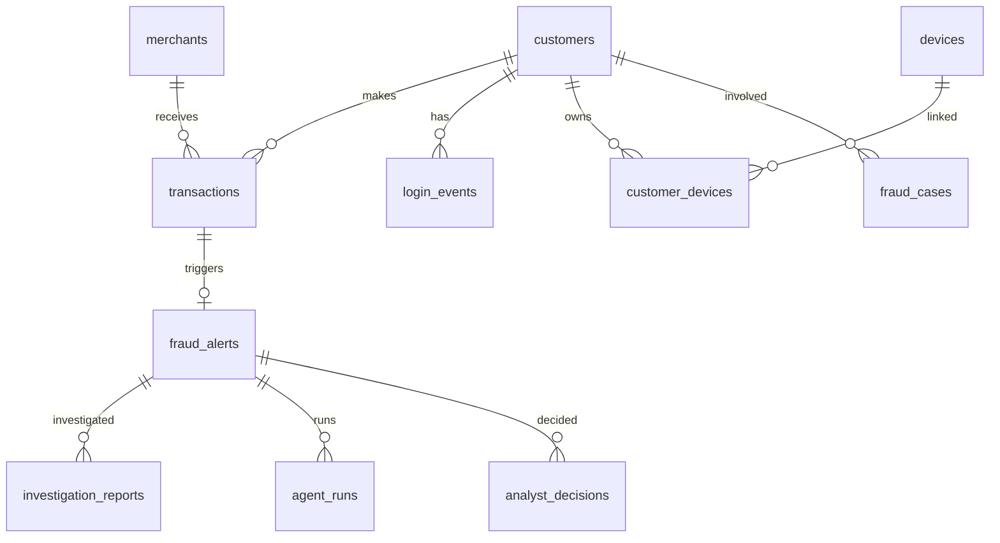

# Data Model

Phase 2 core PostgreSQL schema for the Agentic AI Fraud Investigation Platform.

All data is **synthetic**. No real customer information is used.

## Entity Relationship Diagram

## Tables

### merchants

Merchant catalog with MCC category codes and risk scores.

| Column | Type | Notes |
|--------|------|-------|
| merchant_id | VARCHAR(36) PK | Synthetic ID |
| category_code | VARCHAR(10) | MCC code |
| risk_score | NUMERIC(5,4) | 0–1 risk score |

**Phase:** Populated by data generator (Phase 2). Used by fraud rules (Phase 3) and agents.

### customers

Customer profiles with home location and spending baselines.

| Column | Type | Notes |
|--------|------|-------|
| customer_id | VARCHAR(36) PK | Synthetic ID |
| email | VARCHAR(255) UNIQUE | Faker-generated |
| avg_transaction_amt | NUMERIC(12,2) | Baseline for anomaly detection |
| home_country | CHAR(2) | ISO country code |

### devices

Device fingerprints and trust status.

| Column | Type | Notes |
|--------|------|-------|
| device_id | VARCHAR(36) PK | Synthetic ID |
| fingerprint_hash | VARCHAR(64) | Device fingerprint |
| is_trusted | BOOLEAN | Known trusted device |

### customer_devices

Many-to-many link between customers and devices.

### transactions

Financial transactions — core entity for fraud detection.

| Column | Type | Notes |
|--------|------|-------|
| transaction_id | VARCHAR(36) PK | Synthetic ID |
| amount | NUMERIC(12,2) | Transaction amount |
| is_fraud | BOOLEAN | Ground truth label (synthetic) |
| fraud_scenario | VARCHAR(50) | Scenario type if fraud |
| latitude/longitude | NUMERIC | Geo location |

**Indexes:** customer_id, created_at, partial index on is_fraud = TRUE.

### login_events

Authentication events including failed attempts.

| Column | Type | Notes |
|--------|------|-------|
| success | BOOLEAN | Login outcome |
| failure_reason | VARCHAR(100) | e.g. INVALID_PASSWORD |

### fraud_alerts

Alerts triggered by rules or ML (populated by rules engine in Phase 3).

| Column | Type | Notes |
|--------|------|-------|
| severity | alert_severity | LOW, MEDIUM, HIGH, CRITICAL |
| fraud_score | NUMERIC(5,4) | Weighted score from triggered rules |
| triggered_rules | JSONB | Array of rule names |
| evidence | JSONB | Structured evidence per rule |
| rule_triggered | VARCHAR(100) | Primary rule (legacy convenience) |
| ml_fraud_probability | NUMERIC(5,4) | Phase 4 ML score |

### fraud_cases

Historical resolved fraud cases for RAG retrieval (Phase 9).

| Column | Type | Notes |
|--------|------|-------|
| embedding | vector(384) | pgvector embedding (Phase 9) |
| fraud_type | VARCHAR(50) | ACCOUNT_TAKEOVER, etc. |

### investigation_reports

AI-generated investigation reports (schema now, populated Phase 6+).

### agent_runs

Audit log of agent executions with tokens, latency, tools called.

### analyst_decisions

Human analyst actions (schema now, populated Phase 12+).

## Enums

- `account_status`: ACTIVE, SUSPENDED, CLOSED
- `transaction_status`: PENDING, COMPLETED, DECLINED, REVERSED
- `alert_status`: OPEN, INVESTIGATING, RESOLVED, FALSE_POSITIVE
- `alert_severity`: LOW, MEDIUM, HIGH, CRITICAL
- `analyst_action`: CONFIRM_FRAUD, FALSE_POSITIVE, APPROVE, ESCALATE, REQUEST_INFO
- `recommendation_type`: APPROVE, MANUAL_REVIEW, BLOCK

## Fraud Scenarios

The data generator injects controlled fraud patterns:

| Scenario | Key Signals |
|----------|-------------|
| high-value-fraud | Amount >> customer average |
| account-takeover | Failed logins + new device + foreign txn |
| velocity-attack | 12 txns in 5 minutes |
| geographic-anomaly | Txn far from home location |
| new-device-fraud | First-seen device + risky merchant |
| failed-login-attack | 20 failed logins, no txn |
| fraud-ring | Same device across 6 customers |

## Schema Location

- Canonical: `database/schema/001_initial_schema.sql`
- Migration copy: `database/migrations/V001__initial_schema.sql`
- Docker init: `infrastructure/docker/postgres/init.sql`
