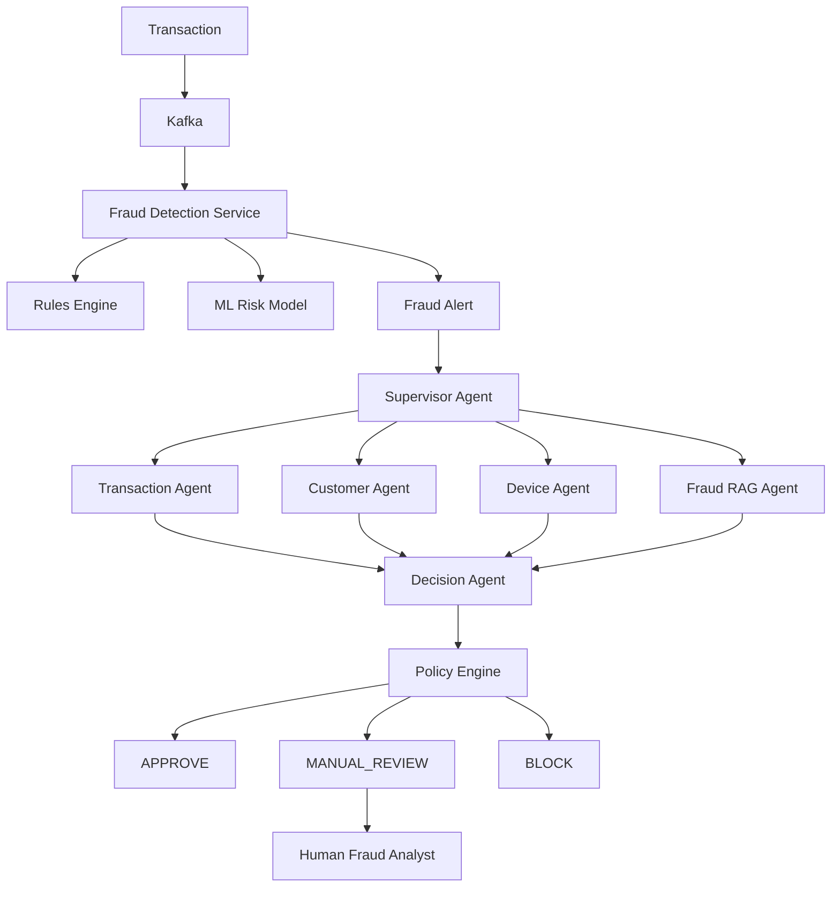

# System Architecture

Production-inspired architecture for autonomous fraud investigation with human oversight.

## Overview

## Components

| Component | Technology | Phase |
|-----------|------------|-------|
| Fraud Detection Service | Spring Boot | 3–4 |
| AI Investigation Service | FastAPI + LangGraph | 6–10 |
| Database | PostgreSQL + pgvector | 2, 9 |
| Event Streaming | Kafka | 11 |
| Analyst UI | React | 13 |

## Principles

1. LLM is not the source of truth — agents use tools for facts.
2. Business policies remain deterministic.
3. Human approval required for sensitive actions.
4. All agent actions are auditable.

See also: [data-model.md](data-model.md), [agent-architecture.md](agent-architecture.md).
